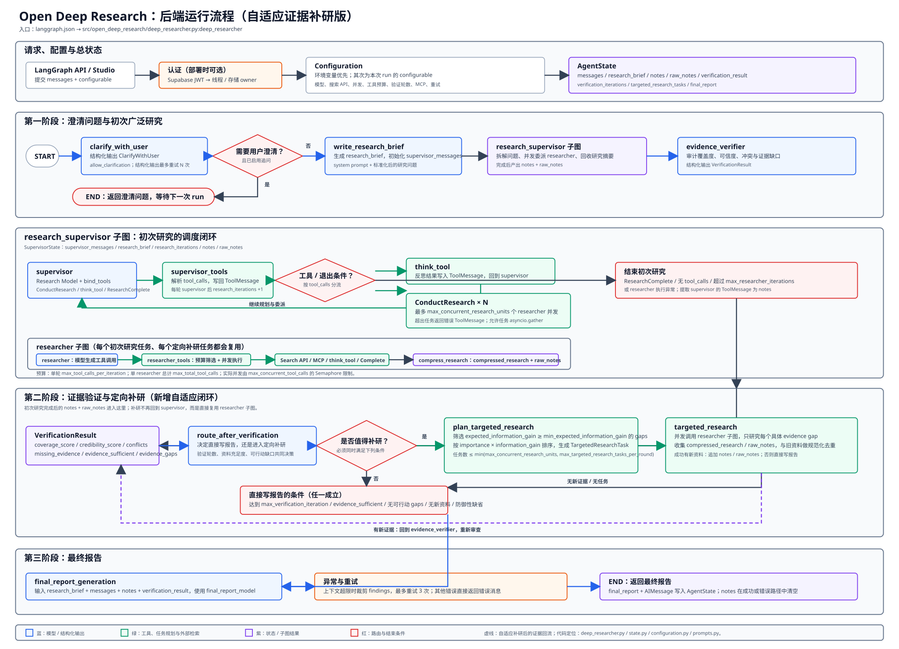
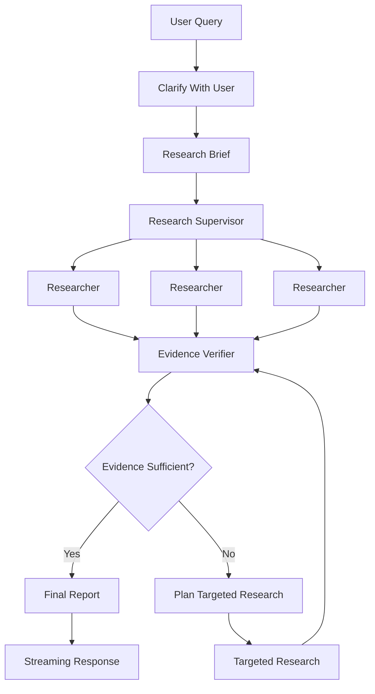

# AskFlow

> A LangGraph-based adaptive deep research agent with research budget control, evidence verification, targeted re-research, tool failure recovery, and dynamic model routing.

AskFlow 是一个基于 **LangGraph + Open Deep Research** 二次开发的深度研究 Agent。

项目保留了 Open Deep Research 的 Supervisor-Researcher 研究框架，并围绕真实 Agent 系统中的几个核心问题进行了进一步扩展：

- Agent 如何控制搜索与 Tool Calling 成本？
- 搜索到的信息是否真的足以回答用户问题？
- 证据不足时，应该重新研究什么，而不是机械重复搜索？
- Tool 超时、限流或服务异常时如何自动恢复？
- 不同 Agent 阶段是否应该使用不同模型？
- 如何将 LangGraph 的执行过程实时呈现到前端？

AskFlow 将这些问题拆解为 **Research Budget Controller、Evidence Verifier、Adaptive Targeted Research、Tool Recovery、Search Fallback、Dynamic Model Router** 等模块，并通过 React 前端提供完整的流式研究体验。

---

## Architecture

<p align="center">
  
</p>



AskFlow 的核心研究闭环：

```text
Plan
  ↓
Research
  ↓
Verify
  ↓
Find Evidence Gaps
  ↓
Targeted Re-Research
  ↓
Verify Again
  ↓
Synthesize
```

---

## Core Agent Improvements

### 1. Research Budget Controller

原始 ReAct Agent 中，“工具调用轮次”并不等价于真实 Tool Invocation 数量。一次 LLM 推理可以同时生成多个 Tool Call，因此 AskFlow 将 **ReAct iteration** 与 **Tool invocation** 拆成两套独立资源模型。

| Budget | Description |
| --- | --- |
| `max_react_iterations` | 单个 Researcher 最大 ReAct 推理轮数 |
| `max_tool_calls_per_iteration` | 单轮最多允许执行的预算型 Tool 数 |
| `max_total_tool_calls` | 单个 Researcher 最大逻辑 Tool 调用总量 |
| `max_concurrent_tool_calls` | 单个 Researcher 最大 Tool 并发量 |

Tool Call 在执行前会经过 Budget Admission：

```text
LLM generated tool calls
          ↓
Identify budgeted tools
          ↓
Per-iteration budget
          ↓
Remaining total budget
          ↓
Admit / Reject
          ↓
Semaphore concurrency control
          ↓
Execute
```

`think_tool`、`ResearchComplete` 等控制类工具不会占用研究预算；基础设施 Retry 属于同一次逻辑 Tool Invocation，因此不会重复消耗预算。

当 Tool Budget 或 ReAct Budget 耗尽后，Researcher 会正常进入 `compress_research`，而不是异常退出。

---

### 2. Evidence Verification

“搜索完成”并不等于“证据已经足够”。

AskFlow 在 Research 与 Final Report 之间加入独立 **Evidence Verifier**：

```text
Research
   ↓
Evidence Verifier
   ↓
Final Report / Targeted Research
```

Verifier 从多个维度评估当前研究资料：

- **Coverage**：是否覆盖用户要求的关键维度
- **Credibility**：当前证据来源是否足够可靠
- **Conflict**：多个来源之间是否存在关键冲突
- **Missing Evidence**：哪些结论仍缺少直接证据

核心结构：

```text
VerificationResult
├── coverage_score
├── credibility_score
├── credibility_issues
├── conflicts
├── missing_evidence
├── evidence_gaps
├── evidence_sufficient
└── summary
```

Evidence Gap 进一步包含：

```text
gap_type
topic
reason
importance
expected_information_gain
```

因此 Agent 不只是知道“当前研究还不够好”，而是知道具体缺什么证据，以及这个缺口是否值得继续搜索。

---

### 3. Adaptive Targeted Re-Research

AskFlow 不使用单纯的 `Research N rounds → Stop` 作为主要终止逻辑。

系统同时使用：

**Hard Stop**
- max verification iterations
- max ReAct iterations
- max Tool budget

**Soft Stop**
- evidence_sufficient
- expected_information_gain
- actionable_evidence_gaps

如果 Verifier 发现证据不足：

```text
Evidence Verifier
        ↓
Evidence Gap
        ↓
Targeted Research Planner
        ↓
Targeted Research
```

新的 Researcher 不会重新研究完整问题，而是只针对缺口补充证据。

针对不同类型的 Evidence Gap：

```text
coverage
→ 搜索缺失维度

credibility
→ 优先寻找官方 / 一手来源

conflict
→ 专门调查冲突来源及版本、时间、范围差异
```

Targeted Research 得到的新 Evidence 会与已有 Notes / Raw Notes 合并，并执行基础去重。

---

### 4. Tool Failure Recovery

AskFlow 增加独立 Tool Recovery Layer：

```text
Tool Call
   ↓
Exception
   ↓
Error Classifier
   ↓
Retry Policy
   ↓
Retry / Fail Fast
   ↓
Search Fallback
```

不同 Provider / HTTP Client 的异常会统一归一化为 timeout、connection、rate_limit、server_error、bad_request、authentication、authorization、not_found、validation 等类别。

典型策略：

| Error | Strategy |
| --- | --- |
| Timeout | Retry |
| Connection Error | Retry |
| HTTP 408 | Retry |
| HTTP 429 | Retry |
| HTTP 5xx | Retry |
| HTTP 400 | Fail Fast |
| HTTP 401 | Fail Fast |
| HTTP 403 | Fail Fast |
| HTTP 404 | Fail Fast |
| HTTP 422 | Fail Fast |

Retry 同时检查 Transient Error、Tool Idempotency 和 Retry Budget，并使用 **Exponential Backoff + Random Jitter**。

对于 Search Tool，系统提供 Search Fallback 策略基础设施：

```text
Primary Search
      ↓
Transient Failure
      ↓
Retries Exhausted
      ↓
Fallback Search Provider
```

AskFlow 还区分 Infrastructure Retry 和 Agent Semantic Retry：网络异常由 Recovery Layer 处理；搜索结果为空或关键词效果差，则交回 Researcher 调整下一轮搜索策略。

---

### 5. Dynamic Model Router

不同 Agent 阶段对模型能力需求不同：

```text
Clarification
→ Speed / Cost

Researcher
→ Tool Calling + Reasoning

Evidence Verifier
→ Structured Output + Reasoning

Compression
→ Long-context Synthesis

Final Report
→ Writing + Long Context
```

AskFlow 使用 Task-aware Model Router。

Router 首先执行硬约束筛选：

```text
Tool Calling support?
Structured Output support?
Context Window enough?
```

随后根据 Task Type、Task Complexity、Estimated Context Size、Model Cost、Task Affinity 进行评分：

```text
Agent Task
    ↓
Task Requirements
    ↓
Complexity Estimation
    ↓
Compatible Model Filter
    ↓
Cost / Capability Scoring
    ↓
Model Decision
```

任务复杂度使用 Rule-based Heuristics 判断，因此不会为了 Model Routing 再额外调用一次 LLM。

---

## Streaming Frontend

AskFlow 提供 React + TypeScript Web Client，通过 `@langchain/langgraph-sdk` 直接连接 LangGraph Agent Server。

LangGraph 原始事件：

```text
updates
messages-tuple
```

经过 Adapter Layer：

```text
LangGraph Events
      ↓
deepResearch.ts
      ↓
progress
content
done
```

再交给 UI。

支持：

- Deep Research 阶段进度展示
- 最终报告 Token Streaming
- Markdown / Code Highlight
- Stop Generation
- Retry / Regenerate
- 多会话本地状态
- Streaming 自动滚动
- 用户主动上滑后暂停自动跟随
- 长消息虚拟列表

Frontend Stack：

```text
React
TypeScript
Vite
Zustand
React Virtuoso
React Markdown
LangGraph SDK
```

---

## Observability

AskFlow 在 Agent Runtime 中保留结构化日志：

```text
[RESEARCH_BUDGET]
[TOOL_RECOVERY]
[SEARCH_FALLBACK]
[EVIDENCE_VERIFIER]
[ADAPTIVE_RESEARCH]
[MODEL_ROUTER]
[FINAL_REPORT_ERROR]
```

可用于观察 Research Iterations、Logical Tool Calls、Retry、Fallback、Evidence Gaps、Verification Rounds、Model Routing、Latency 和 Token Usage。

项目可以结合 LangSmith Trace 对完整 LangGraph Run 进行进一步分析。

---

## Evaluation

AskFlow 计划使用统一 Research Task Set 对原始 Open Deep Research 与 AskFlow 进行对比评测。

公平性约束：

```text
same model providers
same search provider
same query set
same runtime environment
same maximum runtime
```

第一版 Eval 使用约 **30 条 Research Tasks**，覆盖：

- 单事实但要求直接证据
- 多维产品 / API 审查
- 最新信息调研
- 多来源冲突
- 强一手资料要求
- 复杂技术对比
- 容易出现 Evidence Gap 的任务

核心指标：

| Metric | Open Deep Research | AskFlow |
| --- | ---: | ---: |
| Research Success Rate | TBD | TBD |
| Avg. Logical Tool Calls | TBD | TBD |
| Avg. End-to-End Latency | TBD | TBD |
| Evidence Gap Repair Rate | N/A | TBD |
| Tool Failure Recovery Rate | TBD | TBD |
| Avg. Verification Rounds | N/A | TBD |
| Pairwise Win Rate | TBD | TBD |

### Metric Definitions

**Research Success Rate**

```text
成功完成研究且最终报告覆盖任务主要要求
/
总 Eval Task 数
```

**Evidence Gap Repair Rate**

```text
补研后被成功解决的 Evidence Gap
/
实际执行 Targeted Research 的 Actionable Gap
```

**Failure Recovery Rate**

```text
经过 Retry / Fallback 后成功恢复的可恢复 Tool Failure
/
全部可恢复 Tool Failure
```

**Pairwise Win Rate**

```text
AskFlow 被盲测 Judge 判定更优的任务数
/
全部可比较任务数
```

> Evaluation results will be added after the benchmark is completed.

---

## Testing

Backend：

```bash
cd backend
uv run python -m pytest tests -q
```

Frontend：

```bash
cd frontend
npm run build
npm run lint
```

核心测试覆盖 Research Budget、Evidence Verifier、Adaptive Research、Tool Error Classification、Tool Retry、Search Fallback、Model Router 与 Model Runtime Configuration。

---

## Project Structure

```text
AskFlow
│
├── backend
│   ├── src/open_deep_research
│   │   ├── deep_researcher.py
│   │   ├── state.py
│   │   ├── configuration.py
│   │   ├── prompts.py
│   │   ├── utils.py
│   │   ├── tool_recovery.py
│   │   ├── search_fallback.py
│   │   ├── model_router.py
│   │   └── model_utils.py
│   ├── tests
│   ├── langgraph.json
│   └── pyproject.toml
│
├── frontend
│   ├── src
│   │   ├── api
│   │   ├── components
│   │   ├── hooks
│   │   ├── store
│   │   └── type
│   └── package.json
│
└── README.md
```

---

## Quick Start

### Backend

```bash
cd backend
uv sync
```

复制环境变量：

```bash
cp .env.example .env
```

示例：

```env
TAVILY_API_KEY=

BAILIAN_API_KEY=
BAILIAN_BASE_URL=https://dashscope.aliyuncs.com/compatible-mode/v1

LANGSMITH_API_KEY=
LANGSMITH_TRACING=false
```

启动 LangGraph：

```powershell
uvx --refresh --from "langgraph-cli[inmem]" --with-editable . --python 3.11 langgraph dev --allow-blocking
```

Agent API：

```text
http://127.0.0.1:2024
```

### Frontend

```bash
cd frontend
npm install
npm run dev
```

`frontend/.env`：

```env
VITE_LANGGRAPH_API_URL=http://localhost:2024
```

---

## Demo

部署或录制 Demo 后，可以在这里加入：

```html
<p align="center">
  
</p>
```

---

## Based on Open Deep Research

AskFlow backend is based on **LangChain Open Deep Research**:

https://github.com/langchain-ai/open_deep_research

AskFlow 在原始 Supervisor-Researcher 架构上增加：

```text
Research Budget Controller
Evidence Verification
Adaptive Targeted Re-Research
Tool Failure Recovery
Search Fallback
Dynamic Model Router
React Streaming Client
```

原始 Open Deep Research 项目采用 MIT License，见 `backend/LICENSE`。

---

## Design Principle

```text
More Agents
≠
Better Agent System
```

AskFlow 更关注：

```text
Resource Governance
Evidence Quality
Adaptive Decision Making
Failure Recovery
Model Selection
Observability
```

只有当不同 Agent 真正拥有不同 Tool、权限、State 和执行策略时，才值得进一步拆分。

---

## Roadmap

- [ ] 30-task AskFlow vs Open Deep Research Eval
- [ ] Publish evaluation results
- [ ] LangSmith observability cleanup
- [ ] Demo GIF / screenshots
- [ ] Public demo deployment
- [ ] Optional RAG / private knowledge research

---

## Author

**CabbageCannon**

GitHub: https://github.com/CabbageCannon
